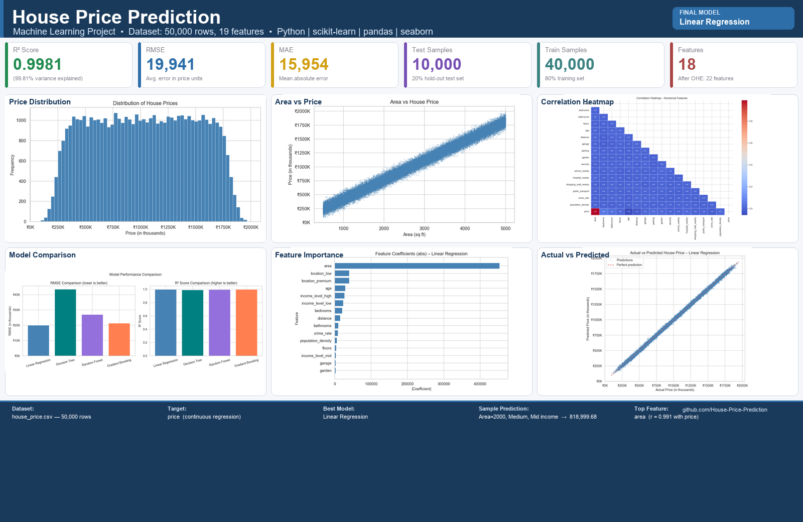

# House Price Prediction Using Machine Learning


---



---

## Project Overview

This project builds a complete **Machine Learning regression system** that predicts residential house prices based on 18 property features. It covers the full data science workflow — from data exploration and preprocessing to model training, evaluation, and deployment-ready model saving.

The project is suitable for academic/university submission and GitHub portfolio.

---

## Problem Statement

The real estate market is complex. Buyers, sellers, and agents need reliable tools to estimate property values objectively. This project trains regression models on historical housing data to predict the price of a house given its physical characteristics, location, and neighbourhood attributes.

---

## Objectives

- Perform thorough **Exploratory Data Analysis** (EDA) on the housing dataset.
- Build and compare multiple **regression models**.
- Select the best-performing model based on objective evaluation metrics.
- Identify the **most influential features** driving house prices.
- Save the final model for production use.
- Demonstrate a **sample prediction** with real input data.

---

## Dataset

| Property | Details |
|---|---|
| File | `house_price.csv` |
| Rows | 50,000 |
| Columns | 19 |
| Target | `price` |
| Missing values | None |
| Duplicate rows | None |

---

## Features

| Feature | Type | Description |
|---|---|---|
| `area` | Numerical | Property area in sq ft |
| `bedrooms` | Numerical | Number of bedrooms |
| `bathrooms` | Numerical | Number of bathrooms |
| `floors` | Numerical | Number of floors |
| `age` | Numerical | Age of the property in years |
| `distance` | Numerical | Distance from city centre (km) |
| `garage` | Binary | Has garage (1/0) |
| `parking` | Binary | Has parking (1/0) |
| `garden` | Binary | Has garden (1/0) |
| `security` | Binary | Has security (1/0) |
| `school_nearby` | Binary | School nearby (1/0) |
| `hospital_nearby` | Binary | Hospital nearby (1/0) |
| `shopping_mall_nearby` | Binary | Mall nearby (1/0) |
| `public_transport` | Binary | Public transport nearby (1/0) |
| `crime_rate` | Numerical | Crime rate in the area |
| `population_density` | Numerical | Population density |
| `location` | Categorical | `low` / `medium` / `premium` |
| `income_level` | Categorical | `low` / `mid` / `high` |
| `price` | **Target** | House price (continuous) |

---

## Technologies Used

| Technology | Version |
|---|---|
| Python | 3.8+ |
| pandas | ≥ 1.5.0 |
| numpy | ≥ 1.23.0 |
| matplotlib | ≥ 3.6.0 |
| seaborn | ≥ 0.12.0 |
| scikit-learn | ≥ 1.2.0 |
| joblib | ≥ 1.2.0 |

---

## Project Structure

```
House-Price-Prediction/
│
├── house_price.csv                          # Dataset (50,000 rows, 19 columns)
├── house_price_prediction.py                # Main Python script (full ML workflow)
├── requirements.txt                         # Python dependencies
├── README.md                                # This file
├── House_Price_Prediction_Project_Report.pdf
│
├── model/
│   └── house_price_model.pkl                # Saved final model + pipeline
│
├── plots/
│   ├── price_distribution.png
│   ├── area_vs_price.png
│   ├── bedrooms_vs_price.png
│   ├── bathrooms_vs_price.png
│   ├── age_vs_price.png
│   ├── distance_vs_price.png
│   ├── crime_rate_vs_price.png
│   ├── location_vs_avg_price.png
│   ├── income_level_vs_avg_price.png
│   ├── correlation_heatmap.png
│   ├── feature_importance.png
│   ├── actual_vs_predicted.png
│   ├── residual_analysis.png
│   └── model_comparison.png
│
└── screenshots/
    └── Dashboard_or_Project_Result.png      ← Project dashboard image (1600×1040 px)
```

---

## Machine Learning Workflow

```
Load Data → EDA → Preprocessing (Pipeline) → Train/Test Split
→ Train Models → Evaluate → Compare → Select Best Model
→ Feature Importance → Save Model → Sample Prediction
```

---

## Data Preprocessing

- **No missing values** found — the dataset is clean.
- **No duplicate rows** found.
- **Categorical encoding**: `location` and `income_level` are encoded using **One-Hot Encoding**.
- **Numerical scaling**: All numerical features are standardised using `StandardScaler`.
- **Pipeline + ColumnTransformer** used to ensure no data leakage — fitting is done only on training data.
- Train/test split is performed **before** any preprocessing fitting.

---

## Exploratory Data Analysis

EDA plots saved to `plots/`:

| Plot | Insight |
|---|---|
| `price_distribution.png` | House prices are roughly normally distributed, ranging from ~90K to ~2M |
| `area_vs_price.png` | Very strong positive linear relationship between area and price |
| `correlation_heatmap.png` | `area` dominates correlation with `price` (r = 0.99) |
| `location_vs_avg_price.png` | Premium locations have significantly higher average prices |
| `income_level_vs_avg_price.png` | High income level areas command higher prices |
| `age_vs_price.png` | Older houses tend to have slightly lower prices |

---

## Models Used

| Model | Description |
|---|---|
| Linear Regression | Baseline linear model assuming linear relationships |
| Decision Tree Regressor | Non-linear tree-based model; captures complex patterns |
| Random Forest Regressor | Ensemble of 100 decision trees; reduces overfitting |
| Gradient Boosting Regressor | Sequential boosting ensemble; strong general performer |

All models are wrapped in a `sklearn.pipeline.Pipeline` that includes the preprocessor.

---

## Evaluation Metrics

| Metric | Meaning |
|---|---|
| **MAE** | Average absolute difference between actual and predicted price |
| **MSE** | Average squared difference; penalises large errors heavily |
| **RMSE** | Square root of MSE — in the same unit as price (most interpretable) |
| **R²** | Proportion of price variance explained by the model (1.0 = perfect) |

---

## Model Comparison

| Model | MAE | RMSE | R² |
|---|---|---|---|
| **Linear Regression** | **15,954** | **19,941** | **0.9981** |
| Decision Tree | 34,454 | 43,493 | 0.9910 |
| Random Forest | 21,519 | 27,033 | 0.9965 |
| Gradient Boosting | 17,046 | 21,305 | 0.9978 |

*(All monetary values are in the same currency unit as the dataset)*

---

## Final Model

**Selected Model: Linear Regression**

**Reason:**
- Lowest MAE (15,954) — smallest average prediction error.
- Lowest RMSE (19,941) — best overall precision in the price unit.
- Highest R² (0.9981) — explains 99.81% of variance in house prices.
- The near-perfect R² is consistent with the very strong linear relationship between `area` and `price` (r = 0.99).

---

## Feature Importance

Feature importance extracted from the **Linear Regression** model (absolute coefficient values after standardisation):

| Rank | Feature | Importance |
|---|---|---|
| 1 | `area` | 454,027 |
| 2 | `location_low` | 40,165 |
| 3 | `location_premium` | 40,091 |
| 4 | `age` | 28,938 |
| 5 | `income_level_high` | 26,631 |
| 6 | `income_level_low` | 23,446 |
| 7 | `bedrooms` | 20,502 |
| 8 | `distance` | 14,988 |
| 9 | `bathrooms` | 10,161 |
| 10 | `crime_rate` | 8,794 |

**Key insight:** `area` is by far the most influential feature, followed by `location` category, `age`, and `income_level`.

---

## Sample Prediction

```python
sample_input = {
    "area": 2000,
    "bedrooms": 3,
    "bathrooms": 2,
    "floors": 2,
    "age": 10,
    "distance": 5,
    "garage": 1,
    "parking": 1,
    "garden": 1,
    "security": 1,
    "school_nearby": 1,
    "hospital_nearby": 1,
    "shopping_mall_nearby": 1,
    "public_transport": 1,
    "crime_rate": 0.2,
    "population_density": 5000,
    "location": "medium",
    "income_level": "mid"
}
```

**Predicted Price: 818,999.68**

---

## How to Run the Project

### 1. Clone the repository

```bash
git clone https://github.com/ud585/House-Price-Prediction.git
cd House-Price-Prediction
```

### 2. Install dependencies

```bash
pip install -r requirements.txt
```

### 3. Run the main script

```bash
python house_price_prediction.py
```

This will:
- Load and inspect the dataset
- Perform EDA and save plots to `plots/`
- Train all four regression models
- Print evaluation metrics and model comparison
- Save the best model to `model/house_price_model.pkl`
- Output a sample price prediction

---

## Installation

```bash
pip install pandas numpy matplotlib seaborn scikit-learn joblib
```

---

## Results

| Metric | Linear Regression (Final Model) |
|---|---|
| MAE | 15,954 |
| MSE | 397,637,546 |
| RMSE | 19,941 |
| R² | 0.9981 |

---

## Key Insights

1. **Area is the most powerful predictor** — a near-perfect linear correlation (r = 0.99) with price.
2. **Location category matters significantly** — premium locations add substantial value.
3. **House age negatively affects price** — older properties are valued lower.
4. **Income level of the neighbourhood** is also a strong driver.
5. **Linear Regression outperforms tree-based models** on this dataset due to the dominant linear relationship between area and price.
6. **No missing or duplicate data** was found — the dataset is clean and ready to use.

---

## Limitations

- The dataset may be synthetic — real-world datasets often have noise, missing values, and more complex non-linear relationships.
- The Linear Regression model assumes a linear relationship between features and price.
- Features like nearby amenities (school, hospital, etc.) showed very low correlation with price in this dataset.
- No cross-validation or hyperparameter tuning was performed (can be added for further improvement).

---

## Future Improvements

- Apply **cross-validation** (K-Fold) for more robust model evaluation.
- Perform **hyperparameter tuning** using GridSearchCV or RandomizedSearchCV.
- Explore **XGBoost** or **LightGBM** for potentially better performance.
- Deploy the model as a **web application** using Flask or Streamlit.
- Add **SHAP values** for more explainable model interpretability.
- Collect real-world housing data for more practical predictions.

---

## Conclusion

This project demonstrates a complete end-to-end machine learning pipeline for house price prediction. Starting from raw data, we explored, cleaned, and preprocessed 50,000 housing records, trained four regression models, and selected **Linear Regression** as the final model based on objective evaluation metrics (MAE = 15,954, RMSE = 19,941, R² = 0.9981). The model explains nearly 99.81% of variance in house prices and produces a typical prediction error of about 19,941 currency units.

---

## Author

**Uday Kumar**  
House Price Prediction Using Machine Learning  
GitHub: [House-Price-Prediction](https://github.com/ud585/House-Price-Prediction)

---
"# House-Price-Prediction" 
"# House-Price-Prediction" 
